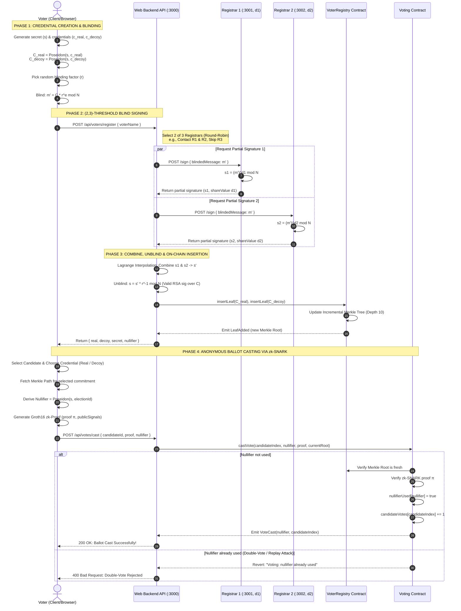
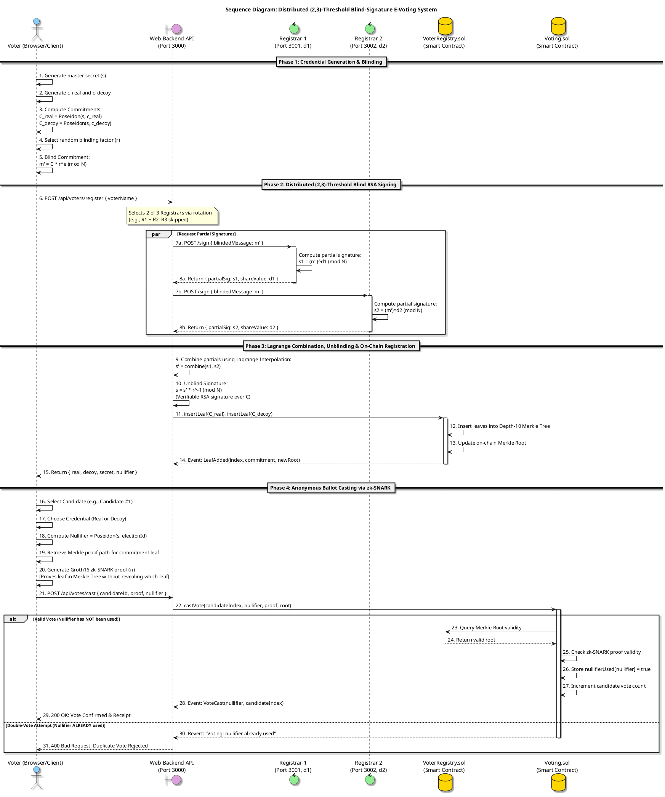

# Sequence Diagram: (2,3)-Threshold Blind-Signature E-Voting System
*(Based on Tang et al. 2023 Extension)*

---

## 1. Complete System Sequence Diagram (Mermaid UML)

---

## 2. PlantUML Source Code (For StarUML Import / PlantText)

You can copy and paste this code directly into **StarUML** (with the PlantUML plugin installed) or into [PlantText.com](https://www.planttext.com) / [PlantUML Editor](https://www.plantuml.com/plantuml/uml):

---

## 3. How to Draw / Present This in StarUML (Step-by-Step for Presentation)

If you are using **StarUML** on your computer to present to your teacher:

### Step 1: Create a Sequence Diagram in StarUML
1. Open StarUML.
2. In the Model Explorer (top right), right-click `Model` -> **Add Diagram** -> **Sequence Diagram**.
3. Name it: `Distributed (2,3)-Threshold E-Voting Sequence`.

### Step 2: Add the 6 Lifelines (Left to Right)
From the left toolbox, drag the following elements onto the canvas:

| # | Element Type in StarUML | Name / Label | Stereotype / Role |
|---|---|---|---|
| 1 | **Actor** | `Voter` | Voter Client / Browser |
| 2 | **Lifeline** | `WebBackend` | Express API Gateway (`:3000`) |
| 3 | **Lifeline** | `Registrar_1` | Key Share $d_1$ (`:3001`) |
| 4 | **Lifeline** | `Registrar_2` | Key Share $d_2$ (`:3002`) |
| 5 | **Lifeline** | `VoterRegistry` | Smart Contract (`VoterRegistry.sol`) |
| 6 | **Lifeline** | `Voting` | Smart Contract (`Voting.sol`) |

### Step 3: Add the Combined Fragments (Boxes)
In StarUML, use **Combined Fragment** from the palette:
1. **Parallel Box (`par`)**:
   - Wrap the partial signature requests to `Registrar_1` and `Registrar_2` to show they happen concurrently.
2. **Alternative Box (`alt`)**:
   - Wrap the ballot verification section at the bottom.
   - Top operand: `[Nullifier Not Used]` -> Normal successful vote casting.
   - Bottom operand: `[Nullifier Already Used]` -> Revert / Rejection of double voting.

---

## 4. Key Talking Points for Your Professor

When explaining this diagram to your teacher, emphasize these 4 points:

1. **Why Blind Signatures? (Messages 1–5):**
   "The voter generates their credential locally and blinds it ($m' = C \cdot r^e \pmod N$). When sending it to the registrars, the registrars only see random numbers. They **cannot** see the voter's identity or credential."

2. **Why 2-of-3 Threshold? (Messages 6–10):**
   "Instead of trusting one central server like in the Tang et al. paper, the private key $d$ is split among 3 registrars using Shamir's Secret Sharing. Any 2 registrars compute partial signatures ($s_i = (m')^{d_i} \pmod N$). The client combines them via Lagrange interpolation. No single registrar ever has the master key."

3. **Why Dual Credentials? (Real vs. Decoy):**
   "Both a Real commitment and a Decoy commitment are inserted as leaves into the on-chain Merkle tree in `VoterRegistry.sol`. To an observer or coercer, both look identical."

4. **Why zk-SNARK + Nullifier? (Messages 16–31):**
   "When voting, the voter proves in zero-knowledge that their commitment is inside the Merkle tree without revealing which leaf is theirs. The deterministic nullifier $\text{Poseidon}(s, \text{electionId})$ ensures each voter can only cast **one ballot**; if they attempt to vote again, the blockchain rejects it with an on-chain revert."
